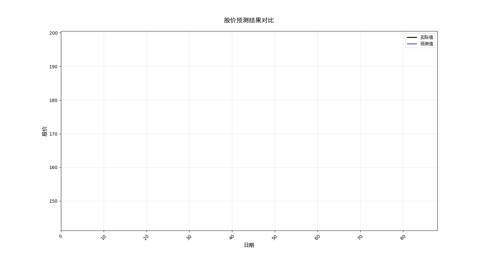

# 股票价格预测系统

这是一个基于随机森林算法的股票价格预测系统，能够通过历史数据分析和机器学习方法对股票价格进行预测和可视化。



## 功能特点

- 自动获取股票历史数据
- 智能特征工程
- 随机森林模型预测
- 动态可视化预测结果
- 特征重要性分析
- 模型性能评估

## 环境要求

- Python 3.x
- 依赖库：
  - efinance
  - pandas
  - numpy
  - matplotlib
  - scikit-learn
  - TkAgg (matplotlib backend)

## 安装说明

1. 克隆项目到本地：
```bash
git clone https://gitcode.com/langgpt/stock_prediction
```

2. 安装所需依赖：
```bash
pip install pandas numpy datetime scikit-learn matplotlib efinance meteostat python-dateutil
```

3. 确保 `SimHei.ttf` 字体文件在项目根目录下（用于中文显示）

## 使用方法

1. 运行股票预测程序：
```bash
python stock_prediction.py
```

2. 根据提示输入：
   - 股票代码（例如：GOOGL）
   - 开始日期（YYYYMMDD格式）
   - 结束日期（YYYYMMDD格式）

3. 系统会自动生成预测结果和可视化图表，保存在 `results` 目录下：
   - `GOOGL_prediction.png`: 股票预测结果图
   - `feature_importance.png`: 特征重要性分析图
   - `prediction_animation.gif`: 预测过程动画

## 项目结构

```
.
├── README.md                    # 项目说明文档
├── SimHei.ttf                  # 中文字体文件
├── prompts                     # 提示词目录
│   └── stcok_prediction_for_marscode.txt  # Mars Code 提示词
├── results                     # 结果输出目录
│   ├── GOOGL_prediction.png    # 股票预测结果图
│   ├── feature_importance.png  # 特征重要性分析图
│   ├── prediction_animation.gif # 预测过程动画
│   └── temperature_prediction.png  # 温度预测结果图
├── stock_prediction.py         # 股票预测主程序
└── temperature_prediction.py   # 温度预测程序
```

## 主要功能模块

### 数据获取 (get_stock_data)
- 支持从网络获取股票数据
- 本地数据缓存功能
- 自动数据格式转换

### 特征工程 (create_features)
- 基础滞后特征
- 移动平均线指标
- 波动率指标
- 价格动量指标
- RSI指标
- 成交量相关特征

### 数据预处理 (prepare_data)
- 自动数据清洗
- 特征标准化
- 训练集和测试集划分

### 可视化功能
1. 动态预测展示 (plot_predictions_dynamic)
   - 实时展示预测结果与实际价格对比
   - 交互式图表
   - 自动坐标轴调整
   - 生成预测动画 (prediction_animation.gif)

2. 特征重要性分析 (plot_feature_importance)
   - 可视化特征影响力
   - 自动保存分析图表 (feature_importance.png)
   - Top-N 特征展示

## 模型评估指标

系统提供以下评估指标：
- R² 得分：衡量模型解释能力
- 均方误差 (MSE)
- 均方根误差 (RMSE)
- 平均绝对误差 (MAE)

## 注意事项

1. 确保网络连接稳定以获取股票数据
2. 首次运行时会下载并缓存历史数据
3. 建议使用合适的时间范围以获得更好的预测效果
4. 图形界面需要 TkAgg 后端支持

## 错误处理

系统包含完整的错误处理机制：
- 数据获取异常处理
- 模型训练异常捕获
- 可视化错误处理
- 详细的错误信息输出

## 可能的改进方向

1. 添加更多技术指标
2. 支持多股票同时分析
3. 引入深度学习模型
4. 优化预测可视化效果
5. 添加网页界面
6. 支持实时数据更新

## License

MIT License

## 贡献指南

欢迎提交 Issue 和 Pull Request 来帮助改进项目。